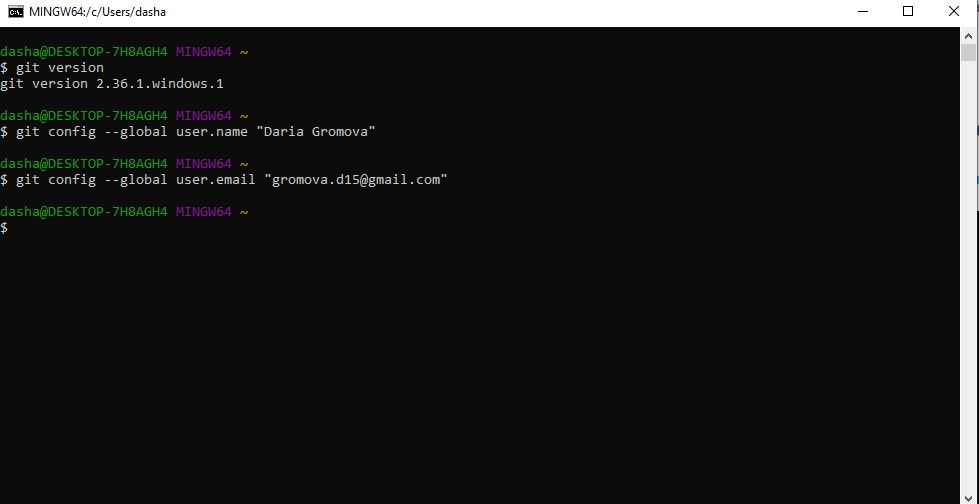

# Инструкция для работы с Git

## Установка программы Git

Для начала нам необходимо скачать **git**, это можно сделать по этой [ссылке](https://git-scm.com/book/ru/v2/Введение-Установка-Git)

## Авторизация в Git

Итак, мы установили git и теперь нам необходимо "представиться" программе, для того, чтобы было понятно, кто вносил правки в код (если с файлом работает не один человек)

* чтобы указать имя пользователя, нужно ввести следующую команду git:

> git config --global user.name “User name”

* чтобы указать e-mail ползователя, нужно ввести следующую команду git:

> git config --global user.email user_e-mail@example.com

## Основные команды Git

Для того, чтобы нам начать работать с git в программе VSCode нам необходимо на рабочем столе создать  новую папку и назвать ее, в программе VSCode нам необходимо нажать на кнопку Open Folder (Открыть папку) и выбрать нужную нам папку. Далее справа в окне под названием Explorer нам необходимо создать новый файл с помощью правой кнопки мыши или нажать на кнопку New file (Новый файл).

Для начала нам необходимо инициализировать наш проект с помощью команды

> git init

Данную команду необходимо выполнить один раз перед началом работы с файлом

Если мы выполнили определенные действия с файлом и нам необходимо их зафиксировать необходимо нажать **ctrl+s**, а далее использовать следующую команду:

> git add

Данная команда добавит в индекс все файлы, в которых были изменения, а также новые файлы

После этого данные изменения необходимо "закоммитить" с помощью данной команды:

> git commit -m "Название коммита"

Для того, чтобы посмотреть журнал изменений, которые мы выполнили необходимо использовать следующую команду:

> git log

Чтобы узнать статус файла:

> git status

Чтобы посмотреть разницу между текущим и сохраненным файлом:

> git diff

Для того, чтобы создать новую ветку:

> git branch Название_ветки

Для того, чтобы посмотреть созданнве нами ветки, а так же увидеть в какой из веток мы сейчас находимся (она выделяется "звездочкой" (*)), используем следующую команду:

> git branch

Переключение между ветками:

> git checkout Название_ветки

Создание ветки и преключение на нее нам позволяет сделать следующая команда:

> git checkout -b Название_ветки

Переименование ветки:

> git branch -m Старое_название_ветки Новое_название_ветки

Удаление ветки:

> git branch -d Название ветки

Для того, чтобы нам объединить ветки, необходимо перейти на ту  ветку, в которой будут приняты эти изменения, например ветка master, с помощью команды 
> git checkout master 
или другое Название_ветки

и использовать следующую команду:

> git merge Название_ветки

Для того, чтобы отменить процесс слияния (объединения) нескольких веток используем команду:

> git merge -abort

## Работа с удаленным репозитарием

Сначала Вам необходимо зарегистрироваться на сайте github.com, перейдя по следующей [ссылке](https://github.com).

>*Аккаунт на github представляет собой хранилище удаленных репозиториев, возможность интеграции в другие проекты, а так же возможность продемонстрировать Ваши проекты другим пользователям*. 

Для того, чтобы создать новый репозиторий Вам необходимо перейти на странице на вкладку *"Your profile"*, далее *"Repositories"* и нажать на кнопку *"New"*. В открывшемся окне нужно придумать название для Вашего репозитория, по желанию, можно написать описание к вашему репозиторию, далее выбрать  уровень доступа *Публичный* или *Приватный*, по желанию можно выбрать создание файла README.md (этот файл представляет собой "визитную карточку" вашего репозитория), далее нажать на кнопку *"Create repository"*. 
Открыть программу VS Code и ввести следующие команды:
 - git init
 - git add Название файла *(пример, README.md)*
 - git commit -m "Initial commit"
 - git branch -M main *(или master, или другое название ветки, в которой Вы будете работать)*
 - git remote add origin *https:// Название Ссылки .git*
 - git push -u origin main *(или master, или другое название ветки, которую Вы  выбрали для дальнейшей работы)*

Эти команды необходимы для того, чтобы Вы могли "подружить" локальный репозиторий с удаленным.

### *Основные команды для работы с GitHub:*

* git push - это команда для того, чтобы отправить локальный репозиторий на удаленный на GitHub;
* git pull - это команда для того, чтобы подгрузить изменения с удаленного репозитория на GitHub на локальный;
* git clone - это команда для того, чтобы перенести чужой репозиторий в программу VS Code и далее работать с ним. Но прежде чем, выполнять данную команду репозиторий необходимо сохранить в своем аккаунте, использую кнопку *fork*
